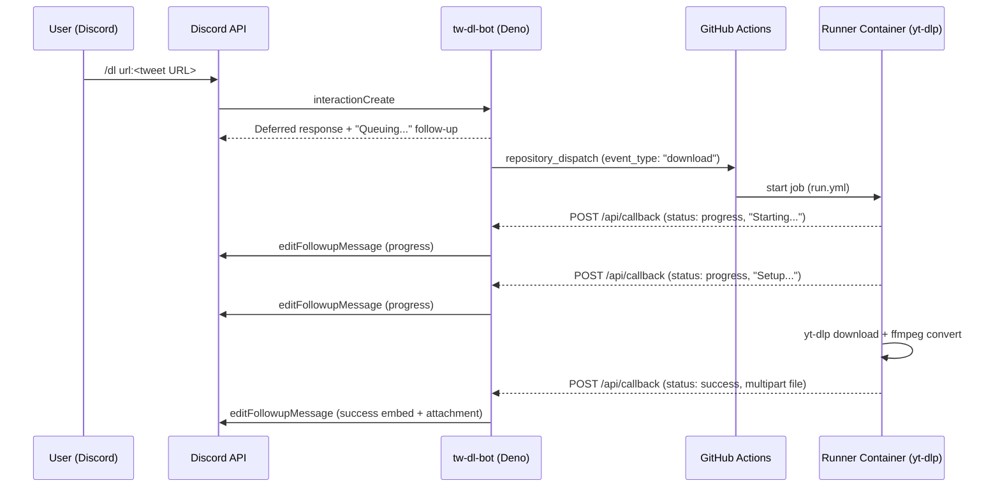
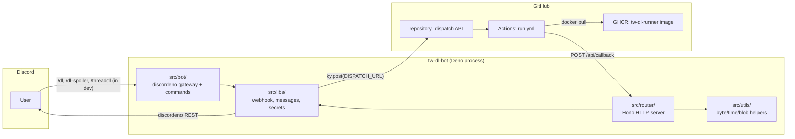

# Architecture

`tw-dl-bot` is split into two cooperating processes:

1. **Bot service** — a long-running Deno process that talks to Discord (gateway + REST) and exposes an HTTP callback endpoint built with [Hono](https://hono.dev/).
2. **Runner workflow** — a GitHub Actions job (`.github/workflows/run.yml`) that pulls a prebuilt Docker image (`ghcr.io/<owner>/tw-dl-runner:latest`), runs `yt-dlp` against the requested URL, and POSTs progress / success / failure callbacks back to the bot.

The two are decoupled by two HTTP boundaries:

- Bot → GitHub: `POST` to a `repository_dispatch` URL that triggers the runner workflow.
- GitHub Actions → Bot: `POST` to the bot's `/api/callback` endpoint with status updates and the resulting media file.

## End-to-end flow

## Component map

## Module layout

| Path | Responsibility |
| --- | --- |
| `src/main.ts` | Boots the bot (`startBot`) and the Hono server (`serve`); mounts the API router at `/api`. |
| `src/bot/bot.ts` | Creates the discordeno bot, registers global slash commands, dispatches `interactionCreate`. |
| `src/bot/commands.ts` | Slash command definitions for `dl`, `dl-spoiler`, `threaddl`. |
| `src/bot/interactionCreate.ts` | Validates URL arguments, posts an initial "Queuing..." follow-up, fires the GitHub `repository_dispatch`. |
| `src/router/index.ts` | Mounts `ping` and `callback` routes under `/api`. |
| `src/router/ping.ts` | Health check at `GET /api/ping` returning `OK!`. |
| `src/router/callback.ts` | `POST /api/callback` — pattern-matches the body and dispatches to success / progress / failure handlers. |
| `src/router/functions/` | Per-status handlers (`success.dl.single`, `success.dl.multi`, `success.dlSpoiler.*`, `progress`, `failure`). |
| `src/router/messages/` | Builds the Discord follow-up payloads sent on success / error. |
| `src/libs/constants.ts` | Centralised constants: HTTP paths, status codes, message colors, command-type / action-type strings. |
| `src/libs/secrets.ts` | Loads required env vars (`DISCORD_TOKEN`, `DISPATCH_URL`, `GITHUB_TOKEN`); fails fast if any are missing. |
| `src/libs/webhook.ts` | `ky.post` wrapper that triggers GitHub `repository_dispatch` with the `client_payload`. |
| `src/libs/messages/` | Builders for progress / success / failure / error embeds. |
| `src/libs/contents/` | Converts callback bodies into `singleFileContent` / `multiFilesContent` blobs. |
| `src/utils/` | Pure helpers: `fileToBlob`, `unitChangeForByte`, `millisecondChangeFormat`. |
| `.github/workflows/build.yml` | Builds and pushes the runner image to GHCR on `push` to `master` and on a daily schedule. |
| `.github/workflows/run.yml` | The `repository_dispatch` consumer that runs `yt-dlp` and posts callbacks. |
| `docker/Dockerfile` | The runner image: Ubuntu base + `ffmpeg`, `aria2`, `jq`, `bc`, `gawk`, `curl`, plus a nightly `yt-dlp`. |

## Status lifecycle

The runner pushes one of three statuses to `/api/callback`:

| `status` | Meaning | Bot behaviour |
| --- | --- | --- |
| `progress` | Step changed (e.g. setup, downloading, converting). | Edits the existing follow-up message with the new content, as long as it is within `EDIT_FOLLOWUP_MESSAGE_TIME_LIMIT` (15 minutes). |
| `success` | yt-dlp finished and returned one or more files. | Edits the follow-up to a success embed and attaches the file(s); applies `SPOILER_` prefix when `commandType` is `dl-spoiler`. |
| `failure` | yt-dlp or one of the runner steps failed. | Edits the follow-up to a failure embed. |

The combination of `status`, `commandType` (`dl` / `dl-spoiler`), and `actionType` (`single` / `multi`) selects the handler in `src/libs/custom.ts` (`Custom.CallbackPattern`).

## Why GitHub Actions?

Running `yt-dlp` inside the bot process would couple egress IP, CPU, and disk to the bot host. Pushing the work to GitHub Actions keeps the bot small and stateless, and lets each download run in a fresh container with the latest `yt-dlp` nightly.
