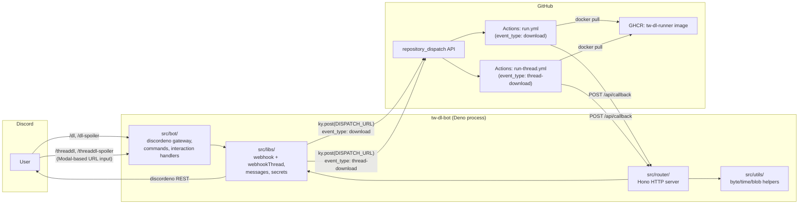

# Architecture

> 日本語版: [./jp/architecture.md](./jp/architecture.md)

`tw-dl-bot` is split into two cooperating processes:

1. **Bot service** — a long-running Deno process that talks to Discord (gateway + REST) and exposes an HTTP callback endpoint built with [Hono](https://hono.dev/).
2. **Runner workflows** — two GitHub Actions workflows that pull a prebuilt Docker image (`ghcr.io/<owner>/tw-dl-runner:latest`), run `yt-dlp` against the requested URL(s), and POST progress / success / failure callbacks back to the bot:
   - `.github/workflows/run.yml` — single-URL pipeline triggered by `repository_dispatch` type `download` (used by `/dl`, `/dl-spoiler`).
   - `.github/workflows/run-thread.yml` — thread / parallel pipeline triggered by `repository_dispatch` type `thread-download`. A `prepare` job builds a strategy matrix from the `links` payload and a `run-with-container` job fans out one shard per URL. Shared by both `/threaddl` and `/threaddl-spoiler` (the `commandType` is opaquely passed through, and the bot's callback router uses it to decide spoiler vs. non-spoiler).

The two halves are decoupled by two HTTP boundaries:

- Bot → GitHub: `POST` to a `repository_dispatch` URL that triggers one of the runner workflows.
- GitHub Actions → Bot: `POST` to the bot's `/api/callback` endpoint with status updates and the resulting media file.

## End-to-end flow (`/dl`, `/dl-spoiler`)


## End-to-end flow (`/threaddl`, `/threaddl-spoiler`)

Both thread commands collect URLs through a Discord **Modal** so the user can paste many links without quoting. The slash command's first response is the Modal itself; the actual work runs on the follow-up `ModalSubmit` interaction. Once URLs are extracted, the bot creates a thread, posts one placeholder per URL, and dispatches a single `thread-download` event carrying every URL. The runner workflow fans out one matrix shard per URL; each shard edits its own placeholder via `editMessage` (which is not bounded by the 15-minute interaction-token window). The two commands share the same handler (`runThreadFlow`) and the same workflow (`run-thread.yml`); the only difference is the `commandType` carried through the pipeline (`threaddl` vs `threaddl-spoiler`), which the bot's callback router uses to decide whether to apply the `SPOILER_` filename prefix on success.

```mermaid
sequenceDiagram
    participant U as User (Discord)
    participant D as Discord API
    participant B as tw-dl-bot (Deno)
    participant GH as GitHub Actions
    participant R as Runner Containers (yt-dlp, parallel)

    U->>D: /threaddl name:<...> (or /threaddl-spoiler)
    D->>B: interactionCreate (ApplicationCommand -> threadInteractionCreate.ts)
    B-->>D: Modal response<br/>title: 'Add URLs to "<name>"',<br/>customId: '<commandType>|<name>',<br/>InputText (Paragraph, customId: "urls")
    U->>D: User pastes URLs and submits Modal
    D->>B: interactionCreate (ModalSubmit -> threadModalSubmit.ts)
    Note over B: customId allowlist check<br/>(threaddl / threaddl-spoiler)<br/>regex /https?:\/\/[^\s,;]+/g extraction
    B->>B: runThreadFlow.ts (shared)
    B-->>D: Deferred response (on the ModalSubmit interaction)
    B->>D: startThreadWithoutMessage (auto-archive 1440min, type 11)
    B->>D: sendMessage (thread) "Queuing..." x N (one per URL)
    B->>GH: repository_dispatch (event_type: "thread-download", links[])
    GH->>GH: prepare job builds matrix from links
    par per-URL shard
        GH->>R: shard 1 (run-thread.yml, matrix.link)
        R-->>B: POST /api/callback (progress / success / failure)
        B->>D: editMessage (in thread)
    and
        GH->>R: shard 2 (run-thread.yml, matrix.link)
        R-->>B: POST /api/callback
        B->>D: editMessage (in thread)
    end
```

## Component map



## Module layout

| Path | Responsibility |
| --- | --- |
| `src/main.ts` | Boots the bot: calls `await registerCommands(bot)` (Discord REST), then `startBot(bot)`, mounts the Hono app at `/api`, and serves it via `serve` from `std/http/server`. |
| `src/bot/bot.ts` | Creates the discordeno bot and wires `interactionCreate` to dispatch by `interaction.type`. `ModalSubmit` interactions go straight to `threadModalSubmit`. `ApplicationCommand` interactions are routed by command name to `interactionCreate` (`/dl`, `/dl-spoiler`) or `threadInteractionCreate` (`/threaddl`, `/threaddl-spoiler`). No top-level `await` (importing `bot.ts` is side-effect-free, which is what makes it testable). |
| `src/bot/registerCommands.ts` | Calls `bot.helpers.createGlobalApplicationCommand` for `dlCommand`, `dlSpoilerCommand`, `threadDlCommand`, `threadDlSpoilerCommand`. Invoked from `main.ts` once before `startBot`. |
| `src/bot/commands.ts` | Slash command definitions for `dl`, `dl-spoiler`, `threaddl`, `threaddl-spoiler`. The two thread commands now declare only the `name` option — URLs are collected via the Modal opened on response. |
| `src/bot/interactionCreate.ts` | Handles `/dl` and `/dl-spoiler`: validates URL arguments, posts an initial "Queuing..." follow-up per URL, fires `webhook` (one dispatch per URL). The `If(...).else(...)` chain is `await`-ed so the call settles before returning. |
| `src/bot/threadInteractionCreate.ts` | Handles the **ApplicationCommand** half of `/threaddl` and `/threaddl-spoiler`: reads the `name` option, truncates it to 80 chars (`MAX_NAME_IN_CUSTOM_ID`), and immediately responds with a Modal whose `customId` is `<commandType>\|<threadName>` and whose Paragraph `InputText` (`customId: "urls"`, `maxLength: 4000`) collects the multi-line URL list. Does not defer (a Modal must be the first response). |
| `src/bot/threadModalSubmit.ts` | Handles the **ModalSubmit** half. Splits `customId` on the first `\|`, validates the prefix against the `Set<string>` allowlist `{ "threaddl", "threaddl-spoiler" }` (forged ModalSubmits with unknown prefixes are silently dropped), extracts URLs from the InputText via `/https?:\/\/[^\s,;]+/g`, and hands `(commandType, threadName, contents)` off to `runThreadFlow`. |
| `src/bot/runThreadFlow.ts` | Shared thread-creation + queue + dispatch flow. ACKs the (Modal-Submit) interaction, validates inputs, enforces the `guildId` guard, calls `startThreadWithoutMessage`, posts one `🕑Queuing...` placeholder per URL inside the thread (silent drops on failure), and fires a single `webhookThread` (`event_type: "thread-download"`) carrying all `links`. On dispatch failure, every placeholder is edited to an error embed. Used by both `/threaddl` and `/threaddl-spoiler`; the `commandType` is opaquely passed through. |
| `src/router/index.ts` | Mounts `ping` and `callback` routes under `/api`. |
| `src/router/ping.ts` | Health check at `GET /api/ping` returning `OK!`. |
| `src/router/callback.ts` | `POST /api/callback` — pattern-matches `[status, commandType, actionType]` and dispatches to success / progress / failure handlers (including `Success.ThreadDl.{Single,Multi}`, `Success.ThreadDlSpoiler.{Single,Multi}`, `ProgressThread`, `ProgressThreadSpoiler`, `FailureThread`, `FailureThreadSpoiler`). |
| `src/router/functions/callbackSuccessFunctions.ts` | Shared `handleSingleSuccess(infoObject, spoiler, useThread)` and `handleMultiSuccess(...)` are reused by `dl`, `dlSpoiler`, `threadDl`, and `threadDlSpoiler` — only the `spoiler` and `useThread` flags differ. |
| `src/router/functions/callbackProgressFunctions.ts` | `progress` handler. When `commandType` is `"threaddl"` **or** `"threaddl-spoiler"` it uses `bot.helpers.editMessage(channel, message)` and bypasses the 15-minute follow-up edit window. |
| `src/router/functions/callbackFailureFunctions.ts` | `failure` handler with the same thread-aware branching as `progress` (covers both `"threaddl"` and `"threaddl-spoiler"`). |
| `src/router/messages/successMessage.ts` | Builds the success message; `useThread` short-circuits both the 15-minute time window and the oversize-fallback gate so the placeholder in the thread is always edited in-place. |
| `src/libs/constants.ts` | Centralised constants: HTTP paths, status codes, message colors, command-type / action-type strings (including `THREAD_DL_SPOILER`), `Webhook.Json.EVENT_TYPE` (`download`) / `EVENT_TYPE_THREAD` (`thread-download`), `Thread.{AUTO_ARCHIVE_DURATION, TYPE}`. |
| `src/libs/secrets.ts` | Loads required env vars (`DISCORD_TOKEN`, `DISPATCH_URL`, `GITHUB_TOKEN`); fails fast if any are missing. |
| `src/libs/webhook.ts` | Two `ky.post` wrappers: `webhook` (single-URL `download` dispatch) and `webhookThread` (multi-URL `thread-download` dispatch carrying `links: { link, message }[]`, used by both `/threaddl` and `/threaddl-spoiler`). |
| `src/libs/custom.ts` | `Custom.CallbackPattern` triplets including `ThreadDl.{Single,Multi}`, `ThreadDlSpoiler.{Single,Multi}`, `ProgressThread`, `ProgressThreadSpoiler`, `FailureThread`, `FailureThreadSpoiler`. |
| `src/libs/messages/` | Builders for progress / success / failure / error embeds. |
| `src/libs/contents/` | Converts callback bodies into `singleFileContent` / `multiFilesContent` blobs. |
| `src/utils/` | Pure helpers: `fileToBlob`, `unitChangeForByte`, `millisecondChangeFormat`. |
| `tests/` | Deno test suite mirroring the `src/` structure; for each production module, a corresponding `.test.ts` file exercises its public API. Tests import the same modules as production code and stub `bot.helpers.*` per test. |
| `.github/workflows/build.yml` | Builds and pushes the runner image to GHCR on `push` to `master` and on a daily schedule. |
| `.github/workflows/run.yml` | `repository_dispatch` (type `download`) consumer that runs `yt-dlp` and posts callbacks. Used by `/dl` and `/dl-spoiler`. |
| `.github/workflows/run-thread.yml` | `repository_dispatch` (type `thread-download`) consumer with a `prepare` job (builds a `strategy.matrix` from `client_payload.links`) and a `run-with-container` job that fans out shards in parallel (`max-parallel: 16`, `fail-fast: false`). Used by `/threaddl`. |
| `.github/workflows/test.yml` | CI: `deno lint` → `deno task test` → `deno task test:coverage`, with the coverage report appended to the GitHub Step Summary. |
| `docker/Dockerfile` | The runner image: Ubuntu base + `ffmpeg`, `aria2`, `jq`, `bc`, `gawk`, `curl`, plus a nightly `yt-dlp`. Shared by both `run.yml` and `run-thread.yml`. |

## Status lifecycle

The runner pushes one of three statuses to `/api/callback`:

| `status` | Meaning | Non-thread (`dl`, `dl-spoiler`) | Thread (`threaddl`, `threaddl-spoiler`) |
| --- | --- | --- | --- |
| `progress` | Step changed (e.g. setup, downloading, converting). | Edits the follow-up via `editFollowupMessage`, only while within `EDIT_FOLLOWUP_MESSAGE_TIME_LIMIT` (15 minutes). | Edits the placeholder in the thread via `editMessage(channel, message)`. The 15-minute window does not apply. |
| `success` | yt-dlp finished and returned one or more files. | Edits the follow-up to a success embed and attaches the file(s); applies `SPOILER_` prefix when `commandType` is `dl-spoiler`. Falls back to a fresh `sendMessage` if the file is oversized. | Edits the placeholder in the thread to a success embed and attaches the file(s); applies `SPOILER_` prefix when `commandType` is `threaddl-spoiler`. Both the 15-minute window and the oversize fallback are short-circuited so the message stays in-place inside the thread. |
| `failure` | yt-dlp or one of the runner steps failed. | Edits the follow-up to a failure embed within the 15-minute window, otherwise sends a new message. | Edits the placeholder in the thread to a failure embed (no time limit). |

The combination of `status`, `commandType` (`dl` / `dl-spoiler` / `threaddl` / `threaddl-spoiler`), and `actionType` (`single` / `multi` / `thread-single` / `thread-multi`) selects the handler in `src/libs/custom.ts` (`Custom.CallbackPattern`).

### Modal `customId` round-trip and security

The Modal-based thread commands rely on the Modal `customId` to carry context across the two-interaction handshake. Discord caps `customId` at 100 characters, so the bot uses a deliberate budget:

```text
<commandType>|<threadName-truncated-to-MAX_NAME_IN_CUSTOM_ID>
```

| Slot | Limit | Reason |
| --- | --- | --- |
| `commandType` prefix | up to 16 chars (`"threaddl-spoiler"`) | The longest currently registered. The `Set<string>` allowlist in `threadModalSubmit.ts` is `{ "threaddl", "threaddl-spoiler" }`; anything else is silently dropped. |
| `\|` separator | 1 char | Splits at the first `\|` only, so thread names containing `\|` round-trip without ambiguity. |
| `threadName` tail | 80 chars (`MAX_NAME_IN_CUSTOM_ID`) | 100 − 16 − 1 = 83; rounded down to 80 for headroom. The same truncated value is used as the actual Discord thread name and as the basis for the Modal `title` (further truncated to 40 to fit Discord's 45-char `title` limit). |

`customId` is user-attacker-controllable in the sense that any client can submit a forged `ModalSubmit` with an arbitrary `customId`. The handler treats the prefix as untrusted: it is **only** matched by exact string equality against the `Set` allowlist. Invalid prefixes return early with no embed, no log entry, and no side-effect.

## Why GitHub Actions?

Running `yt-dlp` inside the bot process would couple egress IP, CPU, and disk to the bot host. Pushing the work to GitHub Actions keeps the bot small and stateless, lets each download run in a fresh container with the latest `yt-dlp` nightly, and — for `/threaddl` — provides cheap horizontal fan-out via `strategy.matrix` without any extra orchestration in the bot.
