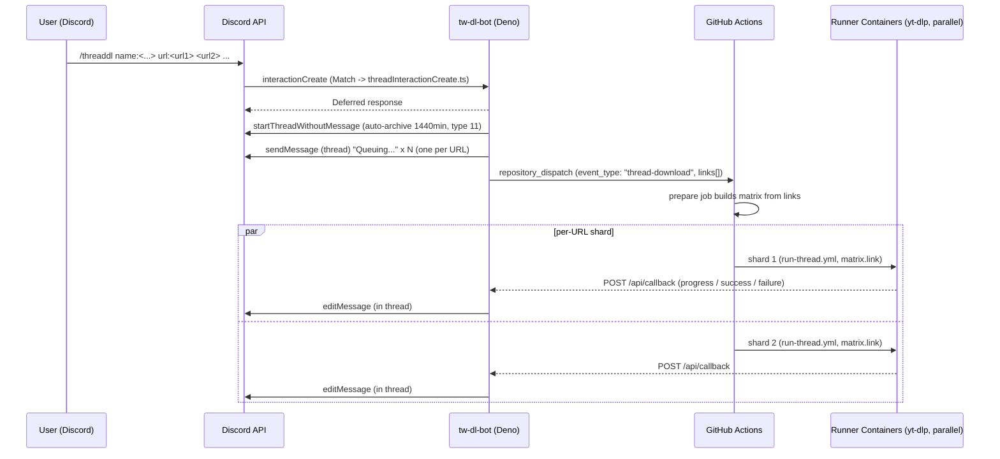
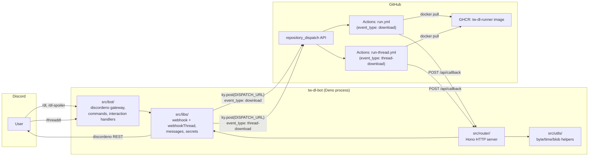

# Architecture

`tw-dl-bot` is split into two cooperating processes:

1. **Bot service** — a long-running Deno process that talks to Discord (gateway + REST) and exposes an HTTP callback endpoint built with [Hono](https://hono.dev/).
2. **Runner workflows** — two GitHub Actions workflows that pull a prebuilt Docker image (`ghcr.io/<owner>/tw-dl-runner:latest`), run `yt-dlp` against the requested URL(s), and POST progress / success / failure callbacks back to the bot:
   - `.github/workflows/run.yml` — single-URL pipeline triggered by `repository_dispatch` type `download` (used by `/dl`, `/dl-spoiler`).
   - `.github/workflows/run-thread.yml` — thread / parallel pipeline triggered by `repository_dispatch` type `thread-download`. A `prepare` job builds a strategy matrix from the `links` payload and a `run-with-container` job fans out one shard per URL (used by `/threaddl`).

The two halves are decoupled by two HTTP boundaries:

- Bot → GitHub: `POST` to a `repository_dispatch` URL that triggers one of the runner workflows.
- GitHub Actions → Bot: `POST` to the bot's `/api/callback` endpoint with status updates and the resulting media file.

## End-to-end flow (`/dl`, `/dl-spoiler`)

## End-to-end flow (`/threaddl`)

`/threaddl` creates a Discord thread, posts one placeholder message per URL inside it, and dispatches a single `thread-download` event carrying every URL. The runner workflow fans out one matrix shard per URL; each shard edits its own placeholder via `editMessage` (which is not bounded by the 15-minute interaction-token window).

## Component map

## Module layout

| Path | Responsibility |
| --- | --- |
| `src/main.ts` | Boots the bot: calls `await registerCommands(bot)` (Discord REST), then `startBot(bot)`, mounts the Hono app at `/api`, and serves it via `serve` from `std/http/server`. |
| `src/bot/bot.ts` | Creates the discordeno bot and wires `interactionCreate` to dispatch by command name to either `interactionCreate` (`/dl`, `/dl-spoiler`) or `threadInteractionCreate` (`/threaddl`). No more top-level `await` (importing `bot.ts` is now side-effect-free, which is what makes it testable). |
| `src/bot/registerCommands.ts` | Calls `bot.helpers.createGlobalApplicationCommand` for `dlCommand`, `dlSpoilerCommand`, `threadDlCommand`. Invoked from `main.ts` once before `startBot`. |
| `src/bot/commands.ts` | Slash command definitions for `dl`, `dl-spoiler`, `threaddl`. |
| `src/bot/interactionCreate.ts` | Handles `/dl` and `/dl-spoiler`: validates URL arguments, posts an initial "Queuing..." follow-up per URL, fires `webhook` (one dispatch per URL). The `If(...).else(...)` chain is now `await`-ed so the call settles before returning. |
| `src/bot/threadInteractionCreate.ts` | Handles `/threaddl`: requires `guildId`, creates a thread via `startThreadWithoutMessage`, posts one placeholder per URL inside the thread, and fires a single `webhookThread` (carrying all `links`). |
| `src/router/index.ts` | Mounts `ping` and `callback` routes under `/api`. |
| `src/router/ping.ts` | Health check at `GET /api/ping` returning `OK!`. |
| `src/router/callback.ts` | `POST /api/callback` — pattern-matches `[status, commandType, actionType]` and dispatches to success / progress / failure handlers (including the new `Success.ThreadDl.Single|Multi`, `ProgressThread`, `FailureThread` patterns). |
| `src/router/functions/callbackSuccessFunctions.ts` | Shared `handleSingleSuccess(infoObject, spoiler, useThread)` and `handleMultiSuccess(...)` are reused by `dl`, `dlSpoiler`, and `threadDl` — only the `spoiler` and `useThread` flags differ. |
| `src/router/functions/callbackProgressFunctions.ts` | `progress` handler. When `commandType === "threaddl"` it uses `bot.helpers.editMessage(channel, message)` and bypasses the 15-minute follow-up edit window. |
| `src/router/functions/callbackFailureFunctions.ts` | `failure` handler with the same thread-aware branching as `progress`. |
| `src/router/messages/successMessage.ts` | Builds the success message; `useThread` short-circuits both the 15-minute time window and the oversize-fallback gate so the placeholder in the thread is always edited in-place. |
| `src/libs/constants.ts` | Centralised constants: HTTP paths, status codes, message colors, command-type / action-type strings, `Webhook.Json.EVENT_TYPE` (`download`) / `EVENT_TYPE_THREAD` (`thread-download`), `Thread.{AUTO_ARCHIVE_DURATION, TYPE}`. |
| `src/libs/secrets.ts` | Loads required env vars (`DISCORD_TOKEN`, `DISPATCH_URL`, `GITHUB_TOKEN`); fails fast if any are missing. |
| `src/libs/webhook.ts` | Two `ky.post` wrappers: `webhook` (single-URL `download` dispatch) and `webhookThread` (multi-URL `thread-download` dispatch carrying `links: { link, message }[]`). |
| `src/libs/custom.ts` | `Custom.CallbackPattern` triplets including the new `ThreadDl.{Single,Multi}`, `ProgressThread`, `FailureThread`. |
| `src/libs/messages/` | Builders for progress / success / failure / error embeds. |
| `src/libs/contents/` | Converts callback bodies into `singleFileContent` / `multiFilesContent` blobs. |
| `src/utils/` | Pure helpers: `fileToBlob`, `unitChangeForByte`, `millisecondChangeFormat`. |
| `tests/` | Deno test suite mirroring the `src/` tree (e.g. `tests/bot/registerCommands.test.ts`, `tests/libs/isUrl.test.ts`). Tests import the same modules as production code and stub `bot.helpers.*` per test. |
| `.github/workflows/build.yml` | Builds and pushes the runner image to GHCR on `push` to `master` and on a daily schedule. |
| `.github/workflows/run.yml` | `repository_dispatch` (type `download`) consumer that runs `yt-dlp` and posts callbacks. Used by `/dl` and `/dl-spoiler`. |
| `.github/workflows/run-thread.yml` | `repository_dispatch` (type `thread-download`) consumer with a `prepare` job (builds a `strategy.matrix` from `client_payload.links`) and a `run-with-container` job that fans out shards in parallel (`max-parallel: 16`, `fail-fast: false`). Used by `/threaddl`. |
| `.github/workflows/test.yml` | CI: `deno lint` → `deno task test` → `deno task test:coverage`, with the coverage report appended to the GitHub Step Summary. |
| `docker/Dockerfile` | The runner image: Ubuntu base + `ffmpeg`, `aria2`, `jq`, `bc`, `gawk`, `curl`, plus a nightly `yt-dlp`. Shared by both `run.yml` and `run-thread.yml`. |

## Status lifecycle

The runner pushes one of three statuses to `/api/callback`:

| `status` | Meaning | Non-thread (`dl`, `dl-spoiler`) | Thread (`threaddl`) |
| --- | --- | --- | --- |
| `progress` | Step changed (e.g. setup, downloading, converting). | Edits the follow-up via `editFollowupMessage`, only while within `EDIT_FOLLOWUP_MESSAGE_TIME_LIMIT` (15 minutes). | Edits the placeholder in the thread via `editMessage(channel, message)`. The 15-minute window does not apply. |
| `success` | yt-dlp finished and returned one or more files. | Edits the follow-up to a success embed and attaches the file(s); applies `SPOILER_` prefix when `commandType` is `dl-spoiler`. Falls back to a fresh `sendMessage` if the file is oversized. | Edits the placeholder in the thread to a success embed and attaches the file(s). Both the 15-minute window and the oversize fallback are short-circuited so the message stays in-place inside the thread. |
| `failure` | yt-dlp or one of the runner steps failed. | Edits the follow-up to a failure embed within the 15-minute window, otherwise sends a new message. | Edits the placeholder in the thread to a failure embed (no time limit). |

The combination of `status`, `commandType` (`dl` / `dl-spoiler` / `threaddl`), and `actionType` (`single` / `multi` / `thread-single` / `thread-multi`) selects the handler in `src/libs/custom.ts` (`Custom.CallbackPattern`).

## Why GitHub Actions?

Running `yt-dlp` inside the bot process would couple egress IP, CPU, and disk to the bot host. Pushing the work to GitHub Actions keeps the bot small and stateless, lets each download run in a fresh container with the latest `yt-dlp` nightly, and — for `/threaddl` — provides cheap horizontal fan-out via `strategy.matrix` without any extra orchestration in the bot.
