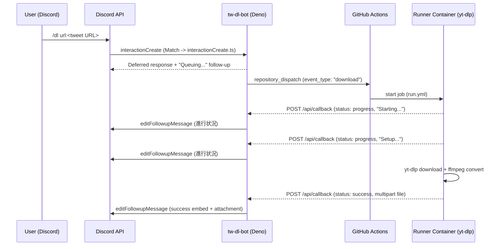
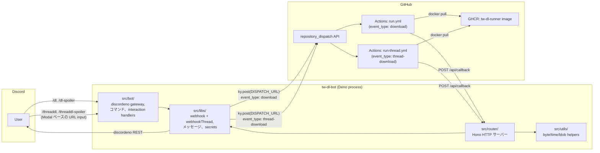

> English: [../architecture.md](../architecture.md)

# アーキテクチャ

`tw-dl-bot` は2つの協調プロセスに分割されています：

1. **Bot service** — Discord（gateway + REST）と通信し、[Hono](https://hono.dev/) で構築されたHTTP callback endpointを公開するlong-running Deno process。
2. **Runner workflows** — 事前構築されたDocker image（`ghcr.io/<owner>/tw-dl-runner:latest`）をプルし、リクエストされたURLに対して `yt-dlp` を実行し、progress / success / failure callbacksをBotにPOSTする2つのGitHub Actions workflows：
   - `.github/workflows/run.yml` — `repository_dispatch` type `download` によってトリガーされた単一URLパイプライン（`/dl`、`/dl-spoiler` で使用）。
   - `.github/workflows/run-thread.yml` — `repository_dispatch` type `thread-download` によってトリガーされたthread / parallelパイプライン。`prepare` jobは `links` payloadからstrategy matrixを構築し、`run-with-container` jobはURLごとに1つのshardをファンアウトします。`/threaddl` と `/threaddl-spoiler` の両方で共有（`commandType` はopaquelyに渡され、Botのcallback routerがそれを使用してspoiler vs. non-spoilerを決定）。

2つのハーフは2つのHTTP boundaryによってdecoupledされます：

- Bot → GitHub：runner workflowsの1つをトリガーする `repository_dispatch` URLへの `POST`。
- GitHub Actions → Bot：status updatesと結果のmedia fileをBotの `/api/callback` endpointに `POST`。

## End-to-end flow（`/dl`、`/dl-spoiler`）



## End-to-end flow（`/threaddl`、`/threaddl-spoiler`）

両方のthreadコマンドはDiscord **Modal** を通じてURLを収集するため、ユーザーはquoteなしで多くのリンクを貼り付けることができます。スラッシュコマンドの最初の応答はModal自体です。実際の作業はfollow-up `ModalSubmit` interactionで実行されます。URLが抽出されると、Botはthreadを作成し、URLごとに1つのplaceholderを投稿し、すべてのURLを運ぶ単一の `thread-download` eventをディスパッチします。runner workflowはURLごとに1つのmatrix shardをファンアウトします。各shardはzero-padded `index`（01、02、…）を受け取り、`editMessage` 経由で独自のplaceholderを編集します（これは15分のinteraction-token windowにboundedされません）。`shardIndex` はcallback pipelineを通じてforwardedされるため、BotがDiscord embedsで `#N-XX`（N = `github.run_number`、XX = `shardIndex`）形式のrun numbersをフォーマットでき、どのshardがどのURLを処理したかをidentifyできます。2つのコマンドは同じhandler（`runThreadFlow`）と同じworkflow（`run-thread.yml`）を共有します。唯一の違いはpipelineを通じて運ばれる `commandType`（`threaddl` vs `threaddl-spoiler`）です。これはBotのcallback routerが成功時に `SPOILER_` filename prefixを適用するかどうかを決定するために使用されます。

```mermaid
sequenceDiagram
    participant U as User (Discord)
    participant D as Discord API
    participant B as tw-dl-bot (Deno)
    participant GH as GitHub Actions
    participant R as Runner Containers (yt-dlp, parallel)

    U->>D: /threaddl name:<...> (or /threaddl-spoiler)
    D->>B: interactionCreate (ApplicationCommand -> threadInteractionCreate.ts)
    B-->>D: Modal response<br/>title: 'Add URLs to "<name>"',<br/>customId: '<commandType>|<name>',<br/>InputText (Paragraph, customId: "urls")
    U->>D: User pastes URLs and submits Modal
    D->>B: interactionCreate (ModalSubmit -> threadModalSubmit.ts)
    Note over B: customId allowlist check<br/>(threaddl / threaddl-spoiler)<br/>regex /https?:\/\/[^\s,;]+/g extraction
    B->>B: runThreadFlow.ts (共有)
    B-->>D: Deferred response (on the ModalSubmit interaction)
    B->>D: startThreadWithoutMessage (auto-archive 1440min, type 11)
    B->>D: sendMessage (thread) "Queuing..." x N (1 per URL)
    B->>GH: repository_dispatch (event_type: "thread-download", links[])
    GH->>GH: prepare job builds matrix from links
    par per-URL shard
        GH->>R: shard 1 (run-thread.yml, matrix.link)
        R-->>B: POST /api/callback (進行状況 / 成功 / 失敗)
        B->>D: editMessage (thread 内)
    and
        GH->>R: shard 2 (run-thread.yml, matrix.link)
        R-->>B: POST /api/callback
        B->>D: editMessage (thread 内)
    end
```

## Component map



## Module layout

| Path | Responsibility |
| --- | --- |
| `src/main.ts` | Bot をブート：`await registerCommands(bot)`（Discord REST）を呼び出し、その後 `startBot(bot)` を呼び出し、Hono app を `/api` にマウントし、`std/http/server` から `serve` 経由で提供。 |
| `src/bot/bot.ts` | `intents: Intents.Guilds` で discordeno bot を作成（slash command は gateway にディスパッチされます。bot はguild messages や message content をリッスンしません）。`interactionCreate` を `interaction.type` でディスパッチするようにワイヤリング。`ModalSubmit` interactions は直接 `threadModalSubmit` に行き、`ApplicationCommand` interactions はコマンド名で `interactionCreate`（`/dl`、`/dl-spoiler`）または `threadInteractionCreate`（`/threaddl`、`/threaddl-spoiler`）にルーティングされます。top-level `await` なし（`bot.ts` をインポートすることは side-effect-free で、テスト可能にします）。 |
| `src/bot/registerCommands.ts` | `dlCommand`、`dlSpoilerCommand`、`threadDlCommand`、`threadDlSpoilerCommand` に対して `bot.helpers.createGlobalApplicationCommand` を呼び出します。`main.ts` から `startBot` の前に一度呼び出されます。 |
| `src/bot/commands.ts` | `dl`、`dl-spoiler`、`threaddl`、`threaddl-spoiler` のスラッシュコマンド定義。2 つの thread コマンドは guild 限定で、`dmPermission: false` 経由（thread は guild text/announcement/forum channel 内でのみ作成可能、DM では不可）。すべての 4 つのコマンドは Discord の API registration 用に options と descriptions を宣言します。 |
| `src/bot/interactionCreate.ts` | `/dl` と `/dl-spoiler` を処理：URL arguments を検証し、URL ごとに初期「Queuing...」follow-up を投稿、`webhook` を火します（URL ごとに 1 つのディスパッチ）。`If(...).else(...)` chain は `await`-ed であり、呼び出しは返される前に settle します。 |
| `src/bot/threadInteractionCreate.ts` | `/threaddl` と `/threaddl-spoiler` の**ApplicationCommand** ハーフを処理：`name` option を読み取り、80 文字に切り詰め（`MAX_NAME_IN_CUSTOM_ID`）、直ちに Modal で応答します。`customId` は `<commandType>\|<threadName>`、Paragraph `InputText`（`customId: "urls"`、`maxLength: 4000`）は複数行 URL リストを収集します。defer しません（Modal は interaction への最初の応答である必要があります）。 |
| `src/bot/threadModalSubmit.ts` | **ModalSubmit** ハーフを処理。最初の `\|` で `customId` を分割、prefix を `Set<string>` allowlist `{ "threaddl", "threaddl-spoiler" }` に対して検証（unknown prefix を持つ forged ModalSubmits は silent に drop）、InputText から `/https?:\/\/[^\s,;]+/g` 経由で URL を抽出、`(commandType, threadName, contents)` を `runThreadFlow` に引き渡し。 |
| `src/bot/runThreadFlow.ts` | 共有 thread-creation + queue + dispatch フロー。（Modal-Submit） interaction を ACK、inputs を検証、`guildId` guard を enforce、`startThreadWithoutMessage` を呼び出し、thread 内に URL ごとに 1 つの `🕑Queuing...` placeholder を投稿（失敗時は silent drop）、すべての `links` を運ぶ単一の `webhookThread`（`event_type: "thread-download"`）を火します。dispatch failure 時、すべての placeholder は error embed に編集されます。`/threaddl` と `/threaddl-spoiler` の両方で使用。`commandType` は opaquely に渡されます。 |
| `src/router/index.ts` | `/api` の下に `ping` と `callback` routes をマウント。 |
| `src/router/ping.ts` | `GET /api/ping` での health check が `OK!` を返します。 |
| `src/router/callback.ts` | `POST /api/callback` — `[status, commandType, actionType]` を pattern-match し、success / progress / failure handlers にディスパッチ（`Success.ThreadDl.{Single,Multi}`、`Success.ThreadDlSpoiler.{Single,Multi}`、`ProgressThread`、`ProgressThreadSpoiler`、`FailureThread`、`FailureThreadSpoiler` を含む）。 |
| `src/router/functions/callbackSuccessFunctions.ts` | 共有 `handleSingleSuccess(infoObject, spoiler, useThread)` と `handleMultiSuccess(...)`は `dl`、`dlSpoiler`、`threadDl`、`threadDlSpoiler` で再利用されます — `spoiler` と `useThread` フラグのみが異なります。 |
| `src/router/functions/callbackProgressFunctions.ts` | `progress` handler。`commandType` が `"threaddl"` **または** `"threaddl-spoiler"` の場合、`bot.helpers.editMessage(channel, message)` を使用し、15 分の follow-up edit window をバイパス。 |
| `src/router/functions/callbackFailureFunctions.ts` | `failure` handler。progress と同じ thread-aware branching（`"threaddl"` と `"threaddl-spoiler"` の両方をカバー）。 |
| `src/router/messages/successMessage.ts` | success message を構築。`useThread` は 15 分のタイムウィンドウと oversize-fallback gate の両方を short-circuit するため、thread 内の placeholder は常に in-place で編集されます。 |
| `src/libs/constants.ts` | 一元化された constants：HTTP paths、status codes、message colors、command-type / action-type strings（`THREAD_DL_SPOILER` を含む）、`Webhook.Json.EVENT_TYPE`（`download`）/ `EVENT_TYPE_THREAD`（`thread-download`）、`Thread.{AUTO_ARCHIVE_DURATION, TYPE}`。 |
| `src/libs/secrets.ts` | 必要な env vars をロード（`DISCORD_TOKEN`、`DISPATCH_URL`、`GITHUB_TOKEN`）。missing な場合は fast fail。 |
| `src/libs/webhook.ts` | 2 つの `ky.post` wrappers：`webhook`（単一 URL `download` dispatch）と `webhookThread`（マルチ URL `thread-download` dispatch。`links: { link, message }[]` を運ぶ、`/threaddl` と `/threaddl-spoiler` の両方で使用）。 |
| `src/libs/custom.ts` | `Custom.CallbackPattern` triplets。`ThreadDl.{Single,Multi}`、`ThreadDlSpoiler.{Single,Multi}`、`ProgressThread`、`ProgressThreadSpoiler`、`FailureThread`、`FailureThreadSpoiler` を含む。 |
| `src/libs/messages/` | progress / success / failure / error embeds の Builders。 |
| `src/libs/contents/` | callback bodies を `singleFileContent` / `multiFilesContent` blobs に変換。 |
| `src/utils/` | Pure helpers：`unitChangeForByte`、`millisecondChangeFormat`。 |
| `tests/` | `src/` 構造をミラーリングする Deno test suite。各 production module には、その public API を実行する対応する `.test.ts` ファイルがあります。Tests は production code と同じ modules をインポートし、`bot.helpers.*` をテストごとに stub。 |
| `tests/bot/` | bot interaction tests：command registration、slash command handlers（`/dl`、`/dl-spoiler`、`/threaddl`、`/threaddl-spoiler`）、Modal submission。 |
| `tests/router/` | Callback router tests：success / progress / failure handler routing、thread vs. non-thread modes のメッセージ編集パターン、ping health check。 |
| `tests/libs/` | Library tests：webhook dispatch payload building、message embed construction、callback pattern matching、secret loading。 |
| `tests/scripts/` | Shell script と AWK tool tests（`deno test` with subprocess execution）：`progress.awk` ffmpeg output parsing、`retry_curl.sh` retry logic、`post_process.sh` format conversion、`conv_progress.sh` callback dispatch。 |
| `.github/scripts/` | Runner workflows で使用される Shell scripts と AWK tools：`progress.awk`（ffmpeg encoding progress output をパース）、`retry_curl.sh`（robust HTTP POST with backoff）、`post_process.sh`（H.264/yuv420p format validation と libx264 による変換）、`conv_progress.sh`（ffmpeg progress log file をモニタリングし、HTTP callbacks を Bot に dispatch）。 |
| `.github/actions/check-and-convert-files/action.yml` | Composite GitHub Action。Inline two-pass HEVC（libx265）+ Opus re-encoding を実行して、files を 10 MB Discord limit に収める。`run.yml` と `run-thread.yml` から呼び出し。 |
| `.github/workflows/build.yml` | runner image を GHCR にビルドしてプッシュ。`master` への `push` および daily schedule で実施。 |
| `.github/workflows/run.yml` | `repository_dispatch`（type `download`）consumer。`yt-dlp` を実行し、callbacks を投稿。`/dl` と `/dl-spoiler` で使用。Composite action と scripts を使用。 |
| `.github/workflows/run-thread.yml` | `repository_dispatch`（type `thread-download`）consumer。`prepare` job（`client_payload.links` から `strategy.matrix` を構築）および `run-with-container` job（shards を並列でファンアウト、`max-parallel: 16`、`fail-fast: false`）。`/threaddl` で使用。Composite action と scripts を使用。 |
| `.github/workflows/test.yml` | CI：`deno lint` → `deno task test` → `deno task test:coverage`。coverage report は GitHub Step Summary に追加。`tests/scripts/` を含むすべての modules をテスト。 |
| `docker/Dockerfile` | runner image：Ubuntu base + `ffmpeg`、`aria2`、`jq`、`bc`、`gawk`、`curl`、plus nightly `yt-dlp`。`run.yml` と `run-thread.yml` の両方で共有。 |

## Status lifecycle

runnerは3つのstatusの1つを `/api/callback` にpush：

| `status` | Meaning | Non-thread（`dl`、`dl-spoiler`） | Thread（`threaddl`、`threaddl-spoiler`） |
| --- | --- | --- | --- |
| `progress` | Step changed（例：setup、downloading、converting）。 | `editFollowupMessage` 経由で follow-up を編集。`EDIT_FOLLOWUP_MESSAGE_TIME_LIMIT`（15 分）内の場合のみ。 | `editMessage(channel, message)` 経由で thread 内の placeholder を編集。15 分の window は適用されません。 |
| `success` | yt-dlp が終了し、1 つ以上のファイルを返した。 | follow-up を success embed に編集し、ファイルをアタッチ。`commandType` が `dl-spoiler` の場合は `SPOILER_` prefix を適用。ファイルが oversized な場合は fresh `sendMessage` に fallback。 | thread 内の placeholder を success embed に編集し、ファイルをアタッチ。`commandType` が `threaddl-spoiler` の場合は `SPOILER_` prefix を適用。15 分 window と oversize fallback の両方が short-circuit されるため、message は thread 内に in-place のままになります。 |
| `failure` | yt-dlp または runner steps の 1 つが失敗した。 | 15 分の window 内では follow-up を failure embed に編集、それ以外の場合は新しい message を送信。 | thread 内の placeholder を failure embed に編集（time limit なし）。 |

`status`、`commandType`（`dl` / `dl-spoiler` / `threaddl` / `threaddl-spoiler`）、`actionType`（`single` / `multi` / `thread-single` / `thread-multi`）の組み合わせは `src/libs/custom.ts`（`Custom.CallbackPattern`）のhandlerを選択します。

### Modal `customId` round-trip とセキュリティ

ModalベースのthreadコマンドはModal `customId` に依存して、2つのinteraction handshakeを介してcontextを運びます。Discordは `customId` を100文字でキャップするため、Botは意図的なbudgetを使用します：

```text
<commandType>|<threadName-truncated-to-MAX_NAME_IN_CUSTOM_ID>
```

| Slot | Limit | Reason |
| --- | --- | --- |
| `commandType` prefix | 最大 16 文字（`"threaddl-spoiler"`） | 現在登録されている最長。`threadModalSubmit.ts` の `Set<string>` allowlist は `{ "threaddl", "threaddl-spoiler" }`。その他はすべて silent に drop。 |
| `\|` separator | 1 文字 | 最初の `\|` でのみ分割するため、`\|` を含む thread 名は ambiguity なく round-trip します。 |
| `threadName` tail | 80 文字（`MAX_NAME_IN_CUSTOM_ID`） | 100 − 16 − 1 = 83。headroom のため 80 に切り詰め。同じ切り詰められた値が実際の Discord thread 名として、および Modal `title` の basis として使用（Discord の 45 文字 `title` limit に fit するため 40 にさらに切り詰め）。 |

`customId` はユーザー attacker-controllableです。任意のclientがarbitrary `customId` を持つforged `ModalSubmit` を送信できます。handlerはprefixをuntrustedとして扱います。exact string equalityに対して `Set` allowlistにのみ照合されます。無効なprefixはembedなし、log entryなし、side-effectなしで早期に返ります。

## Why GitHub Actions?

Bot process内で `yt-dlp` を実行すると、egress IP、CPU、diskがBot hostにcoupledされます。GitHub Actionsに仕事をpushすれば、Botはsmallでstatelessのままになり、各downloadは最新の `yt-dlp` nightlyを備えたfresh containerで実行でき、`/threaddl` ではBotに追加のorchestrationなしで `strategy.matrix` 経由でcheap horizontal fan-outを提供します。
